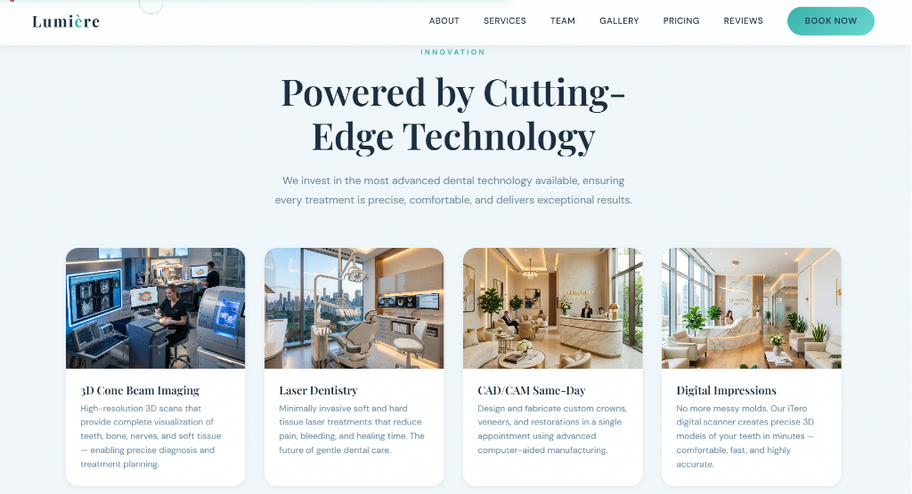

# Willow & Bright Dental Studio — Premium Portfolio Website

A production-quality, premium aesthetic and family dental clinic showcase website designed with **Next.js (App Router)**, **TypeScript**, **Tailwind CSS**, **GSAP**, **Lenis Smooth Scroll**, and **Framer Motion**.

🌐 **Live Demo Link**: [Live Site](https://clinicdemodevinedge.netlify.app/)



---

## 🚀 How to Run Locally

### 1. Install Dependencies
```bash
npm install
```

### 2. Run the Development Server
```bash
npm run dev -- -p 3005
```

Open [http://localhost:3005](http://localhost:3005) in your browser to view the website.

### 3. Build for Production
```bash
npm run build
npm run start
```

---

## 🎨 Visual System & Theme Mappings

The project implements a warm, clean, and clinical-artistic design system:
- **Base Background**: `#FAF9F6` (warm, clean off-white)
- **Primary Brand Teal**: `#0F5C56` (calm, trustworthy, professional)
- **Accent Coral/Peach**: `#FF8B6B` (welcoming highlights, CTA buttons)
- **Secondary Mint**: `#D9F2ED` (soft background cards, credentials)
- **Typography Text**: `#1E292B` (deep charcoal-navy text for legibility)
- **Typography**: 
  - Serif Headlines: **Fraunces** (Google Fonts)
  - Geometric Sans Body/UI: **Plus Jakarta Sans** (Google Fonts)
- **Textures & Blobs**: Ambient blurred gradients (teal/coral) drifting slowly in the background for extra spatial depth.

---

## 🛠 Project Architecture & Animation Code Directory

```
├── src/
│   ├── app/
│   │   ├── layout.tsx         # Global wrapper (Fonts, SmoothScroll, CustomCursor, Noise, metadata)
│   │   ├── page.tsx           # Page assembly and preloader fade-in orchestrator
│   │   └── globals.css        # Tailwind theme tokens, Lenis resets, Custom animations
│   │
│   ├── components/
│   │   ├── sections/          # Page Sections
│   │   │   ├── Preloader.tsx  # SVG tooth outline sketching path + split-curtain exit
│   │   │   ├── Navbar.tsx     # Sticky blur navigation + pulsing available indicator + coral CTA
│   │   │   ├── Hero.tsx       # Headline rotational stagger, parallax drift, rating cards
│   │   │   ├── Marquee.tsx    # Accreditations scrolling strip with pause-on-hover
│   │   │   ├── About.tsx      # Pinned section, organic blob-to-rounded rect clipPath morph
│   │   │   ├── Stats.tsx      # Viewport count-up numbers + custom tooth/smile motif SVGs
│   │   │   ├── Services.tsx   # Pinned horizontal rail with 7 cards + mobile swipe carousel
│   │   │   ├── Process.tsx    # Step journey timeline with scroll-drawn SVG connector line
│   │   │   ├── Doctors.tsx    # Specialist grid with hover scale, quotes, and social SVGs
│   │   │   ├── Gallery.tsx    # Transformations grid with draggable before/after compares
│   │   │   ├── Testimonials.tsx # Draggable patient quotes slider with drifting background blob
│   │   │   ├── Booking.tsx    # Floating-label booking forms with preferred insurance networks
│   │   │   ├── Faq.tsx        # Framer Motion height-animated accordions + rotating coral icons
│   │   │   └── Footer.tsx     # Large watermark mark, sitemaps, back-to-top tooth-arrow
│   │   │
│   │   └── ui/                # Core Animation Primitives & Wrappers
│   │       ├── SmoothScroll.tsx # Lenis smooth scrolling synced to GSAP Ticker
│   │       ├── CustomCursor.tsx # Spring-lag trailing dot + ring morphing to text capsules
│   │       ├── Magnetic.tsx     # Framer Motion spring physics pull container
│   │       ├── SplitText.tsx    # Word-by-word span wrapper with rotational stagger reveals
│   │       └── Noise.tsx        # Tactile film grain overlay
│   │
│   └── lib/
│       └── animations.ts      # GSAP ScrollTrigger plugin configuration & imports
```

---

## ⚡ Key Animation Systems & Implementations

### 1. Smooth Inertia Scrolling (`SmoothScroll.tsx`)
Initializes Lenis globally, utilizing GSAP's ticker to run the `raf` method frame-by-frame. It binds Lenis scrolling to `ScrollTrigger.update()` to prevent lagging or misaligned trigger coordinates.

### 2. Custom Cursor (`CustomCursor.tsx`)
Features a tiny primary dot tracking coordinates instantly, plus a large trailing ring animated using Framer Motion springs (`useSpring`). The ring morphs into an elegant solid coral pill containing a text label ("View" / "Smile") when hovering over gallery items.

### 3. Morphing Pinned Clip-Path (`About.tsx`)
ScrollTrigger animates a CSS mask parameter `clipPath: inset(12% 22% 12% 22% round 140px)` to `inset(0% 0% 0% 0% round 32px)` to morph clinical imagery from a soft organic pebble shape to a full rounded card.

### 4. Interactive Before/After Lightbox Comparison (`Gallery.tsx`)
We built a custom-made touch/mouse draggable image slider. By dragging the central vertical divider handle left and right, users can directly compare "before" and "after" portrait images with clipping overlays.

### 5. Centered SVG Timeline Line-Drawing (`Process.tsx`)
Step cards are connected by an SVG vertical path that draws itself as you scroll. By utilizing `pathLength="1"`, the stroke-dashoffset scales from `1` (hidden) to `0` (fully drawn) dynamically relative to scroll position, bypassing the need for container height calculations.
